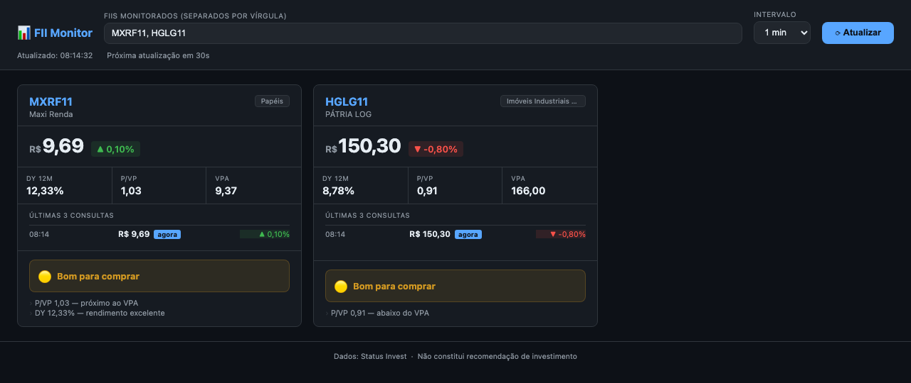

# FII Monitor

POC para consulta automatizada de Fundos de Investimento Imobiliário (FIIs) com scraping via fetch + cheerio + TypeScript.

Inclui servidor REST, dashboard web com atualização automática e dados persistidos em SQLite.

## Screenshot



## Funcionalidades

- Scraping leve do [Status Invest](https://statusinvest.com.br) via `fetch` + `cheerio` (sem browser headless)
- Retorno de dados em JSON e Markdown
- Servidor REST com `GET /fii/:ticker` e `GET /fiis` (lista padrão)
- Dashboard web com atualização automática configurável
- Histórico das últimas consultas por FII persistido em SQLite
- Indicador de momento de compra baseado em P/VP, DY e tendência de preço
- Carteira pessoal: registre cotas por FII, veja dividendo estimado mensal e total

---

## Rodando com o código-fonte

### Pré-requisitos

- Node.js 18+
- npm

### Instalação

```bash
git clone https://github.com/zclt/efedois.git
cd efedois
npm install
```

### Dashboard

```bash
npm run server
```

Acesse `http://localhost:3000` — configure os tickers e o intervalo pelo próprio dashboard.

### Porta customizada

```bash
PORT=8080 npm run server
```

### FIIs padrão (usados pelo CLI e pelo `GET /fiis`)

```bash
DEFAULT_FIIS="MXRF11,HGLG11,XPLG11" npm run server
```

### CLI

```bash
# Consulta MXRF11 (padrão) e salva em output/
npm start

# Ticker específico
npm run fii -- HGLG11

# Múltiplos tickers via variável de ambiente
DEFAULT_FIIS="MXRF11,HGLG11,XPLG11" npm start
```

---

## Rodando com a imagem oficial

### Básico

```bash
docker run -p 3000:3000 ghcr.io/zclt/efedois:main
```

### Com volume para persistir os dados (recomendado)

O banco SQLite fica em `/app/data/monitor.db` dentro do container. Sem volume, os dados são perdidos ao reiniciar.

```bash
docker run -p 3000:3000 \
  -v fii-monitor-data:/app/data \
  ghcr.io/zclt/efedois:main
```

### Com FIIs padrão e porta customizada

```bash
docker run -p 80:3000 \
  -e DEFAULT_FIIS="BTHF11,MXRF11,VGIR11,VISC11,XPLG11" \
  -v fii-monitor-data:/app/data \
  ghcr.io/zclt/efedois:main
```

### Verificar configuração

```bash
# Confirmar variável aplicada
docker run --rm ghcr.io/zclt/efedois:main env | grep DEFAULT_FIIS

# Testar endpoint de lista
curl http://localhost/fiis
```

---

## docker-compose para distribuição

Crie um `docker-compose.yml` em qualquer máquina com Docker instalado — não precisa do código-fonte:

```yaml
services:
  fii-monitor:
    image: ghcr.io/zclt/efedois:main
    ports:
      - "3000:3000"        # troque 3000 pela porta desejada no host
    environment:
      DEFAULT_FIIS: "MXRF11,HGLG11,XPLG11,VISC11,BTHF11"
    volumes:
      - monitor-data:/app/data
    restart: unless-stopped

volumes:
  monitor-data:
```

```bash
# Subir
docker compose up -d

# Atualizar para a versão mais recente
docker compose pull && docker compose up -d

# Ver logs
docker compose logs -f

# Parar
docker compose down
```

> O volume `monitor-data` é gerenciado pelo Docker e persiste entre atualizações de imagem.

---

## REST API

```bash
# FII individual
curl http://localhost:3000/fii/MXRF11

# Lista padrão (DEFAULT_FIIS) em paralelo
curl http://localhost:3000/fiis
```

**Resposta (`200 OK`):**

```json
{
  "ticker": "MXRF11",
  "nome": "Maxi Renda",
  "preco_atual": "9,75",
  "variacao_dia": "0,62%",
  "dy_12m": "12,26",
  "pvp": "1,04",
  "ultimo_dividendo": "0,1000",
  "segmento": "Papéis",
  "gestora": null,
  "fonte": "https://statusinvest.com.br/fundos-imobiliarios/mxrf11",
  "consultado_em": "2026-06-20T19:02:59.464Z",
  "dados_adicionais": { "...": "..." }
}
```

**Erro (`404`):**

```json
{ "erro": "FII não encontrado", "ticker": "XXXXXX" }
```

### Endpoints de persistência

| Método | Rota | Descrição |
|---|---|---|
| `GET` | `/api/config` | Configuração atual (fiis, intervalo) |
| `PUT` | `/api/config` | Salva configuração |
| `GET` | `/api/history` | Histórico de snapshots por ticker |
| `POST` | `/api/history/:ticker` | Registra novo snapshot |
| `GET` | `/api/portfolio` | Carteira (ticker → cotas) |
| `PUT` | `/api/portfolio/:ticker` | Atualiza cotas de um ticker |

---

## Variáveis de ambiente

| Variável | Padrão | Descrição |
|---|---|---|
| `PORT` | `3000` | Porta interna do container |
| `HOST` | `0.0.0.0` | Interface de escuta |
| `DEFAULT_FIIS` | `MXRF11` | Tickers padrão separados por vírgula |

---

## Dashboard

| Funcionalidade | Detalhe |
|---|---|
| Tickers monitorados | Campo separado por vírgula, salvo no banco |
| Intervalo de atualização | 30s, 1min, 2min, 5min, 10min — salvo no banco |
| Histórico por card | Últimas 3 consultas exibidas, até 10 mantidas no banco |
| Indicador de compra | Baseado em P/VP + DY 12M + tendência de preço |
| Carteira | Cotas por FII (0–9999), dividendo estimado, total mensal no cabeçalho |

### Lógica do indicador de compra

| Sinal | Critério |
|---|---|
| 🟢 Excelente | Score ≥ 4 |
| 🟡 Bom | Score ≥ 2 |
| ⚪ Neutro | Score ≥ 0 |
| 🔴 Avaliar com cuidado | Score < 0 |

Pontuação: P/VP abaixo do VPA (+1 a +3), DY acima de 9% (+1 a +2), preço em queda no histórico (+1). Valores acima do VPA ou DY baixo penalizam.

> **Aviso:** este indicador é meramente informativo e não constitui recomendação de investimento.

---

## Estrutura

```
src/
  scraper.ts    # fetch + cheerio → Status Invest
  formatter.ts  # FIIData → JSON / Markdown
  types.ts      # Interfaces TypeScript
  db.ts         # SQLite (better-sqlite3) — config, histórico, carteira
  index.ts      # CLI
  server.ts     # Servidor Fastify (REST + dashboard + API de persistência)
public/
  index.html    # Dashboard (HTML/CSS/JS vanilla)
data/           # Banco SQLite gerado em runtime (não versionado)
output/         # Arquivos gerados pelo CLI
```

## Footprint

| | Valor |
|---|---|
| Imagem Docker | ~69 MB (node:22-alpine + prebuilt SQLite) |
| RAM em execução | ~50 MB |
| Tempo de resposta | 1–2 s |
| Deps de produção | cheerio + fastify + better-sqlite3 |
